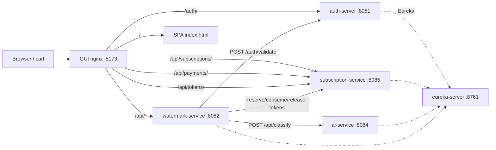

# StegoCloud API Reference

StegoCloud is a polyglot microservice system for **encrypted PNG watermarking**. Clients embed/hide and detect/extract steganographic watermark payloads inside PNG images, with a token-based economy, role-based access control, and optional AI image classification.

The system consists of five application services — Java (Spring Boot), Python (FastAPI), and a Svelte (SvelteKit) GUI — plus supporting infrastructure (Eureka, Config Server, PostgreSQL). There is **no API gateway**; clients reach services either directly on their host port or same-origin through the GUI nginx reverse proxy.

---

## System Architecture & Routing

### Host ports

| Service | Container port | Host port |
|---|---|---|
| GUI (nginx) | 80 | **5173** |
| auth-server | 8081 | **8081** |
| watermark-service (Python/FastAPI) | 8082 | **8082** |
| ai-service | 8084 | **8084** |
| subscription-service | 8085 | **8085** |
| config-server | 8888 | 8888 |
| eureka-server | 8761 | 8761 |
| postgres-db | 5432 | 5433 |

### GUI nginx same-origin routing

The frontend served at `http://localhost:5173` proxies API calls to the right backend via nginx (`gui/nginx.conf`, `client_max_body_size 20m`, **no path rewrite**):

| Public path prefix | Proxied to |
|---|---|
| `/auth/` | auth-server:8081 |
| `/api/subscriptions/` | subscription-service:8085 |
| `/api/payments/` | subscription-service:8085 |
| `/api/tokens/` | subscription-service:8085 |
| `/api/` (catch-all) | watermark-service:8082 |
| `/` (fallback) | SPA `index.html` |

> **Trailing-slash matters.** `/api/subscriptions` (no slash) falls through to the `/api/` catch-all and hits watermark-service, not subscription-service.

**ai-service is internal-only.** It is not proxied by nginx and is reachable only from watermark-service via the `AI_SERVICE_URL` environment variable (`app/ai_client.py`).



---

## Known Issues

### Token-reservation endpoints return 404 (breaks paid watermark operations)

`controller/TokenReservationController.java` in subscription-service declares handler methods and an `@Tag` annotation, but the class is **missing** both `@RestController` and a class-level `@RequestMapping`. As written it is never registered as a Spring MVC handler, so all paths under `/api/tokens/reservations` return **404**.

This breaks every paid watermark operation — `watermark-service-py/app/subscription_client.py` calls these endpoints to reserve, consume, and release tokens. The GUI nginx already proxies `/api/tokens/` to subscription-service, and the client posts to `/api/tokens/reservations`, so the intended base path is unambiguous.

**Fix:** add `@RestController` and `@RequestMapping("/api/tokens/reservations")` to `TokenReservationController`.

See [`subscription-service.md`](./subscription-service.md#token-reservation) for the full intended contract.

---

## Authentication Model

1. **Login.** `POST /auth/login` with `{ email, password }` → receives a **JWT**.
2. **JWT structure** (HMAC-SHA via jjwt): `sub` = username, `userId` = numeric ID (Long), `role` = `USER` or `ADMIN`, `iat`, `exp` = issued + 24h.
3. **Use.** Pass as `Authorization: Bearer <JWT>` on protected endpoints.
4. **Validation.** Protected services do **not** verify the signature locally. They call auth-server `POST /auth/validate?token=<jwt>` which returns a bare `boolean`.
   - subscription-service and ai-service use a Feign `AuthClient`.
   - watermark-service uses httpx in `app/auth.py`.
5. **Role enforcement.** Only watermark-service enforces ADMIN — the `extract` endpoint requires either the watermark owner or an ADMIN token. subscription-service and ai-service require only a *valid* token (no role gate).

---

## Token Economy & Plans

Every paid watermark operation costs tokens. Tokens are reserved before work begins, then consumed on success or released on error. `CAPACITY_CHECK` costs 0 and reserves nothing.

### Operation costs

| Operation | Cost |
|---:|---:|
| CAPACITY_CHECK | 0 |
| DETECT | 1 |
| EXTRACT | 2 |
| VISUALIZE | 3 |
| EMBED_768 | 5 |
| EMBED_1024 | 8 |
| AI_CLASSIFICATION | 2 |

### Plans

| Plan | Monthly tokens | Allowed operations |
|---|---:|---|
| FREE | 50 | CAPACITY_CHECK, DETECT, EMBED_768 |
| STANDARD | 500 | + EXTRACT, VISUALIZE, EMBED_1024 |
| PRO | 2500 | all, incl. AI_CLASSIFICATION |

### Transition rules

- Allowed: FREE→STANDARD, FREE→PRO, STANDARD→PRO.
- Downgrade or repurchasing the active plan is **rejected**.
- A paid plan is valid **one month from purchase/upgrade**. Upgrading starts a new month and **adds** the new plan's full monthly token pool to the current balance.
- On expiry, the plan reverts to FREE and the balance resets to 50.

### Reservation lifecycle

1. **Reserve** → tokens locked for 15 minutes (`TokenReservationPolicy`).
2. **Consume** → tokens deducted permanently.
3. **Release** → tokens returned to balance.

Statuses: `RESERVED`, `CONSUMED`, `RELEASED`. See [`subscription-service.md`](./subscription-service.md#token-reservation) for the full endpoint contract and error codes.

---

## Services Index

| Service | Port | Base path | Purpose | Swagger UI |
|---|---|---|---|---|
| [`auth-server.md`](./auth-server.md) | 8081 | `/auth` | User registration, login, JWT issuance & validation | [`/swagger-ui/index.html`](http://localhost:8081/swagger-ui/index.html) |
| [`subscription-service.md`](./subscription-service.md) | 8085 | `/api/subscriptions`, `/api/payments`, `/api/tokens` | Plan management, mock payments, token balances & reservations | [`/swagger-ui/index.html`](http://localhost:8085/swagger-ui/index.html) |
| [`ai-service.md`](./ai-service.md) | 8084 | `/api` | Image classification via MobileNetV2 ONNX (internal) | [`/swagger-ui/index.html`](http://localhost:8084/swagger-ui/index.html) |
| [`watermark-service.md`](./watermark-service.md) | 8082 | `/api/watermark` | PNG watermark embed, detect, extract, visualize, capacity check | [`/docs`](http://localhost:8082/docs) |
| [`infrastructure.md`](./infrastructure.md) | 8761 / 8888 | — | Eureka service registry & Spring Cloud Config Server | — |

---

## Demo Accounts

| Login | Password | Role | Plan |
|---|---|---|---|
| admin@gmail.com | admin | ADMIN | PRO |
| free@gmail.com | free | USER | FREE |
| standard@gmail.com | standard | USER | STANDARD |
| pro@gmail.com | pro | USER | PRO |
| lowbalance@gmail.com | lowbalance | USER | FREE (low token balance) |

---

## Error Model

Each service follows a different convention:

- **auth-server** (`@RestControllerAdvice`): validation/domain errors return a JSON **field map** `{ "<field>": "<message>" }` (400/409). Malformed JSON / unknown properties return plain text. Bad credentials return plain text.

- **subscription-service**: **No `@RestControllerAdvice`**. Most domain violations surface Spring Boot's default error response (`{ timestamp, status, error, path }`) as **HTTP 500**. The exception is **token-reservation endpoints** (see Known Issues above) which map decisions to explicit status codes with structured `TokenReservationErrorResponse` `{ code, message }`:
  - `403 Forbidden` → `OPERATION_NOT_ALLOWED`
  - `409 Conflict` → `INSUFFICIENT_TOKENS`, `PLAN_NOT_FOUND`, `SUBSCRIPTION_EXPIRED`

- **watermark-service** (FastAPI): errors are JSON `{ "detail": <string> }`, `{ "detail": [{ "loc", "msg", "type" }] }` for 422 request validation, or any dict passed to `JSONResponse`. Auth failures return `{ "detail": { "error": "..." } }` (401/503).

- **ai-service** (`@RestControllerAdvice`): 400 for `IllegalArgumentException`, 500 for everything else.

---

## Machine-Readable Specification

A combined OpenAPI 3.1 specification is maintained at the repository root:

- **`stegocloud-openapi.json`** — [`../../stegocloud-openapi.json`](../../stegocloud-openapi.json) — single-file aggregate of all service APIs.
- **`api-docs.html`** — [`../../api-docs.html`](../../api-docs.html) — rendered HTML view of the combined spec.

To serve locally (e.g., for the Swagger UI viewer or HTML doc):

```bash
cd <repo-root>
python3 -m http.server 8000
# Open http://localhost:8000/stegocloud-openapi.json
```

> **Note on the combined spec.** `stegocloud-openapi.json` has been rebuilt to match these per-service docs: real on-service paths with per-path `servers`, complete request/response schemas (including the token-reservation contract), accurate status codes, and error responses. The token-reservation paths are included as the intended contract and carry the same KNOWN ISSUE note.

---

- [Back to index](./README.md)
- [Combined OpenAPI spec](../../stegocloud-openapi.json)
- [Combined API docs (HTML)](../../api-docs.html)
- [auth-server](./auth-server.md) · [subscription-service](./subscription-service.md) · [ai-service](./ai-service.md) · [watermark-service](./watermark-service.md) · [infrastructure](./infrastructure.md)
